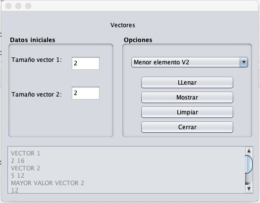

# Alg12020 - Vectores interfaces

**Personal project - University**

The personal project for vectors practice and creation and filling method.
calculation of mathematical operations, using vectors and printing them in graphic interface.

> calculo de operaciones matematicas, usando vectores e imprimiendolas en interface grafica.

- Interface

- Methos.

| Nombre                | Descripción                    |
|---------------------- |:------------------------------:|
|1. llenar_automatico.  |Llena vector automaticame       |
|2. llenar_manual.      |Llena vector manualmente        |
|3. mostrar.            |Imprime vector                  |
|4. promedio.           |Calcula prmedio del vector      |
|5. mayor_valor.        |Trae el valor mayor en un vector|
|6. productoria.        |Calcula la productoria de todo el vector                  |
|7. menor_q.            |Imprime el menor valor de un vector|
|8. par.                |trae la cantidad de numeros pares de un vector            |
|9. impar.              |Trae la cantidad de numeros impares de un vector            |
|10. primos.            |Trae la cantidad de numeros primos de un vector            |
|11. sumvectors         |Suma de 2 vectores         |
|12. restvectors        |Resta de 2 vectores        |
|13. cual_repite        |Busca que valor se repite de un vector                  |
|14. cuantas_repite     |Cuantas veces se repite el valor que mas se repite       |
|15. union              |Imprime una union de vectores (teoria de conjuntos)   |
|16. union_nrepeat      |Imprime la union de vectores sin que se repitan (teoria de conjunto)|
|17. intersection       |Imprime intersección de vectores (teoria de conjunto)    |
|18. difference         |Imprime Direfencia de vectores (teoria de conjunto)    |
|19. bubble             |Metodo de ordenamiento    |
